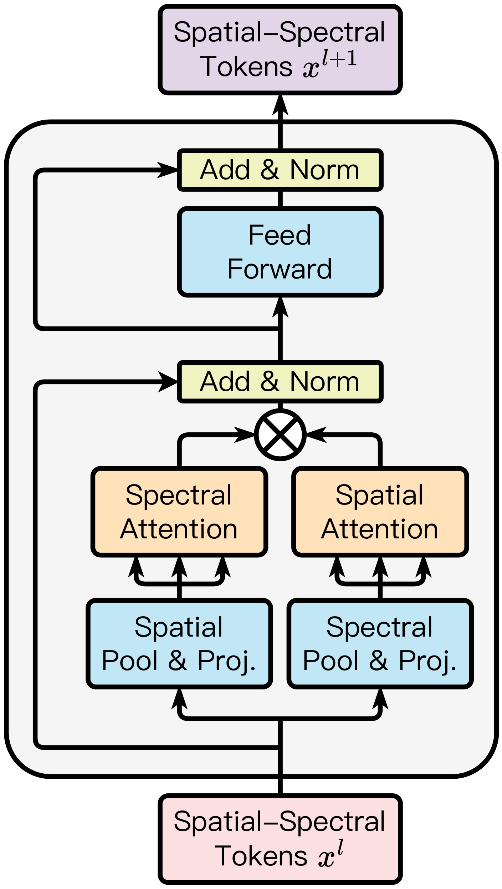

<div align="center">

<h1>LESSViT: Scalable Architecture for Hyperspectral Geospatial Modeling</h1>

[](https://neurips.cc)
[](https://arxiv.org/abs/2503.12843)

</div>

This is the official repository for the NeurIPS 2026 paper
"_LESSViT: Scalable Architecture for Hyperspectral Geospatial Modeling_".

Authors:
[Haozhe Si](https://ehzoahis.github.io/),
Yuxuan Wan,
[Minh Do](https://minhdo.ece.illinois.edu/),
[Deepak Vasisht](https://deepakv.web.illinois.edu/),
[Han Zhao](https://hanzhaoml.github.io/),
Hendrik F. Hamann.

## Overview

<div align="center">

</div>

Modeling hyperspectral imagery (HSI) across sensors is challenging due to variations in wavelength coverage, band sampling, and channel dimensionality. We introduce **LESSViT** (**L**ow-rank **E**fficient **S**patial–**S**pectral **Vi**sion **T**ransformer), a sensor-flexible architecture for cross-spectral generalization.

Our contributions are:

1. **LESS Attention** — a structured low-rank factorization of spatial–spectral attention that reduces complexity from O(N²C²) to O(rNC), where N is the number of spatial tokens, C is the number of spectral channels, and r is the approximation rank.
2. **LESSViT** — a channel-agnostic ViT with wavelength-aware positional encoding (SSRoPE) that enables consistent modeling under varying spectral configurations.
3. **HyperMAE** — a hyperspectral masked autoencoder pre-training strategy with decoupled spatial–spectral masking and hierarchical channel sampling for scalable and robust learning.

## Pre-training

We pre-train LESSViT using **HyperMAE** on the [SpectralEarth](https://github.com/blumenstiel/SpectralEarth) benchmark (EnMAP hyperspectral data) for 200 epochs.

To launch pre-training, run:
```shell
bash launch_train.sh
```

See [`GeospatialFM/scripts/args.py`](GeospatialFM/scripts/args.py) for full argument descriptions.

## Evaluation: Cross-Spectral Generalization

We evaluate LESSViT under a cross-spectral generalization setting on the SpectralEarth benchmark. Models are pre-trained and fine-tuned on a fixed channel configuration (C120_VNIR+) and evaluated across four spectral settings:

| Setting | Description |
|---|---|
| `id` | In-distribution (C120_VNIR+) |
| `ood_a` | Spectral shift (C120_SWIR+) |
| `ood_complement` | Unseen wavelengths (C82, disjoint from training) |
| `ood_full` | Channel expansion (C202, all channels) |

Downstream datasets: `enmap_cdl`, `enmap_corine`, `enmap_eurocrops`.

To launch fine-tuning on a SpectralEarth dataset:
```shell
python3 GeospatialFM/finetune/finetune.py \
    --dataset_name ${DATASET_NAME} \
    --task_type ${TASK_TYPE} \
    --data_dir ${DATA_DIR} \
    --gen_task ${GEN_TASK} \
    --pretrained_model_path ${CHECKPOINT_PATH} \
    --run_name ${RUN_NAME} \
    --output_dir ${OUTPUT_DIR}
```

- `--dataset_name`: One of `enmap_cdl`, `enmap_corine`, `enmap_eurocrops`.
- `--gen_task`: One of `id`, `ood_a`, `ood_complement`, `ood_full`.

## Fine-tuning on GFM-Bench

LESSViT also supports fine-tuning on the GFM-Bench datasets (BigEarthNet, DFC2020, EuroSAT, So2Sat, MARIDA, SegMunich, LandSat). Use the sweep launcher for hyperparameter search:

```shell
python3 sweep_finetune.py \
    --dataset ${DATASET_NAME} \
    --root_dir ${ROOT_DIR} \
    --modal ${MODAL}
```

For linear probing, add `--lp`.

- `--dataset`: One of `bigearthnet`, `dfc2020`, `segmunich`, `eurosat`, `so2sat`, `marida`, `landsat`.
- `--modal`: `optical`, `radar`, or `multi`.

See [`GeospatialFM/finetune/args.py`](GeospatialFM/finetune/args.py) for full argument descriptions.

## Model Weights

Pre-trained model checkpoints will be released soon. Stay tuned!

## Citation

If you find our work helpful, please cite our paper:
```bibtex
@inproceedings{si2026lessvit,
  title     = {{LESSVIT}: Scalable Architecture for Hyperspectral Geospatial Modeling},
  author    = {Haozhe Si and Yuxuan Wan and Minh Do and Deepak Vasisht and Han Zhao and Hendrik F. Hamann},
  booktitle = {Advances in Neural Information Processing Systems},
  year      = {2026},
}
```

## Contact

[Haozhe Si](mailto:haozhes3@illinois.edu), [Han Zhao](mailto:hanzhao@illinois.edu)
