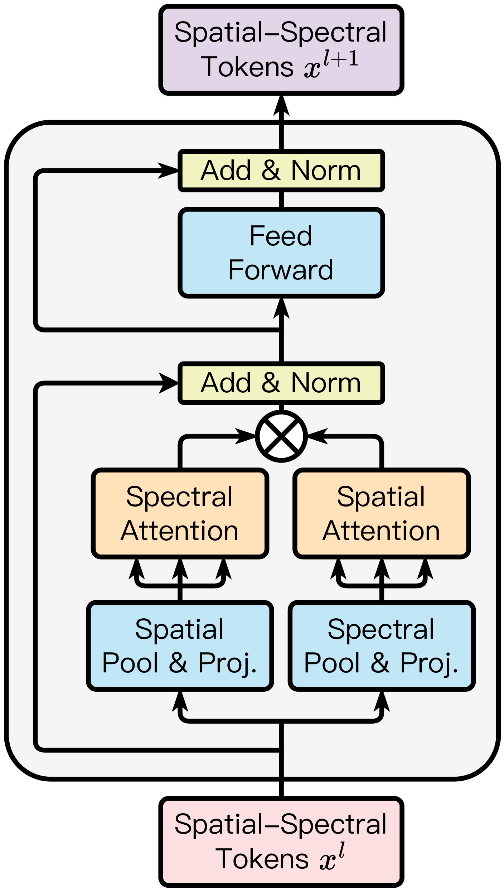

<div align="center">

<h1>LESSViT: Robust Hyperspectral Representation Learning under Spectral Configuration Shift</h1>

[](https://arxiv.org/abs/2605.18541)
[](https://uiuctml.github.io/LESSViT/)
[](https://github.com/uiuctml/LESSViT)

</div>

This is the official repository for the paper
"_LESSViT: Robust Hyperspectral Representation Learning under Spectral Configuration Shift_".

Authors:
[Haozhe Si](https://ehzoahis.github.io/),
Yuxuan Wan,
Yuqing Wang,
[Minh Do](https://minhdo.ece.illinois.edu/),
[Han Zhao](https://hanzhaoml.github.io/).

## Overview

<div align="center">

</div>

Modeling hyperspectral imagery (HSI) across different sensors presents a fundamental challenge due to variations in wavelength coverage, band sampling, and channel dimensionality. We introduce **LESSViT** (**L**ow-rank **E**fficient **S**patial–**S**pectral **Vi**sion **T**ransformer), a sensor-flexible architecture for cross-spectral generalization.

Our contributions are:

1. **LESS Attention** — a structured low-rank factorization of spatial–spectral attention that reduces complexity from O(N²C²) to O(rNC), where N is the number of spatial tokens, C is the number of spectral channels, and r is the approximation rank.
2. **LESSViT** — a channel-agnostic ViT with wavelength-aware positional encoding (SSRoPE) that enables consistent modeling under varying spectral configurations.
3. **HyperMAE** — a hyperspectral masked autoencoder pre-training strategy with decoupled spatial–spectral masking and hierarchical channel sampling for scalable and robust learning.

## Pre-training

We pre-train LESSViT using **HyperMAE** on the [SpectralEarth](https://github.com/blumenstiel/SpectralEarth) benchmark (EnMAP hyperspectral data) for 200 epochs.

To launch pre-training, run:
```shell
bash launch_train.sh
```

See [`GeospatialFM/scripts/args.py`](GeospatialFM/scripts/args.py) for full argument descriptions.

## Evaluation: Cross-Spectral Generalization

We evaluate LESSViT under a cross-spectral generalization setting on the SpectralEarth benchmark. Models are pre-trained and fine-tuned on a fixed channel configuration (C120_VNIR+) and evaluated across four spectral settings:

| Setting | Description |
|---|---|
| `id` | In-distribution (C120_VNIR+) |
| `ood_a` | Spectral shift (C120_SWIR+) |
| `ood_complement` | Unseen wavelengths (C82, disjoint from training) |
| `ood_full` | Channel expansion (C202, all channels) |

Downstream datasets: `enmap_cdl`, `enmap_corine`, `enmap_eurocrops`, `enmap_bdforet`, `enmap_bnetd`.

To launch fine-tuning on a SpectralEarth dataset, run:
```shell
bash launch_finetune.sh
```
which wraps:
```shell
python3 GeospatialFM/finetune/finetune.py \
    --dataset_name ${DATASET_NAME} \
    --task_type ${TASK_TYPE} \
    --data_dir ${DATA_DIR} \
    --gen_task ${GEN_TASK} \
    --model_name ${MODEL_NAME} \
    --pretrained_model_path ${PRETRAINED_MODEL_PATH} \
    --run_name ${RUN_NAME} \
    --output_dir ${OUTPUT_DIR}
```

- `--dataset_name`: One of `enmap_cdl`, `enmap_corine`, `enmap_eurocrops`, `enmap_bdforet`, `enmap_bnetd`.
- `--gen_task`: One of `id`, `ood_a`, `ood_complement`, `ood_full`.
- `--model_name`: The backbone to fine-tune. `lessvit` (this work) or one of the supported baselines: `dofa`, `dinov3`, `specvit`, `spatsigma`, `channelvit`, `hyperfree` ([HyperFree](https://github.com/Jingtao-Li-CVer/HyperFree)).
- `--pretrained_model_path`: **A directory**, not a file — this convention is the same for every backbone. Each encoder's `load_pretrained_weights` globs for its own checkpoint file(s) inside the directory it's given (see `GeospatialFM/models/wrappers/`). By convention, checkpoints for a given backbone live under `results/models/<model_name>/`, the same tree that pre-training and fine-tuning runs save their own checkpoints to.

See [`GeospatialFM/finetune/args.py`](GeospatialFM/finetune/args.py) for full argument descriptions, and [`GeospatialFM/models/registry.py`](GeospatialFM/models/registry.py) for the full set of supported baseline encoders.

### Linear Probing Baseline

As a baseline alongside full fine-tuning, `--lp` freezes the pretrained encoder and trains only a linear read-out head on top of it (a single 1x1 conv + bilinear upsample for segmentation, matching the definition of a linear probe). Same protocol as fine-tuning: train once on `--gen_task id`, then evaluate the frozen probe across the other spectral settings without retraining.

To launch linear-probe training, run:
```shell
bash launch_finetune_lp.sh
```
which wraps `finetune.py` with `--lp` added.

To evaluate cross-spectral generalization for a trained probe, run:
```shell
bash launch_eval_cross_sensor_lp.sh
```
which wraps [`GeospatialFM/finetune/eval_cross_sensor_lp.py`](GeospatialFM/finetune/eval_cross_sensor_lp.py), the `--lp` counterpart to [`GeospatialFM/finetune/eval_cross_sensor.py`](GeospatialFM/finetune/eval_cross_sensor.py). Since `--lp` training saves only the decoder (no encoder/config to reload via `from_pretrained`), this script rebuilds the architecture from CLI args, reloads the original frozen pretrained encoder checkpoint, and loads the trained decoder weights on top -- writing results to the same tidy CSV schema as `cross_sensor_eval.csv`.

Not supported for `--model_name spatsigma`, which bundles its task head inside the encoder.

## Model Weights

Pre-trained model checkpoints will be released soon. Stay tuned!

## Citation

If you find our work helpful, please cite our paper:
```bibtex
@misc{si2026lessvitrobusthyperspectralrepresentation,
      title={LESSViT: Robust Hyperspectral Representation Learning under Spectral Configuration Shift}, 
      author={Haozhe Si and Yuxuan Wan and Yuqing Wang and Minh Do and Han Zhao},
      year={2026},
      eprint={2605.18541},
      archivePrefix={arXiv},
      primaryClass={cs.CV},
      url={https://arxiv.org/abs/2605.18541}, 
}
```

## Contact

[Haozhe Si](mailto:haozhes3@illinois.edu), [Han Zhao](mailto:hanzhao@illinois.edu)
